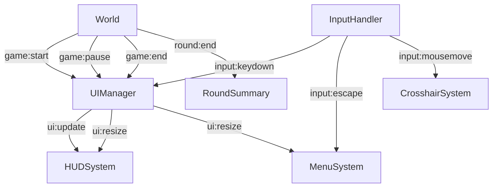

# Event Standardization Guidelines

## Overview

This document establishes standardized event naming conventions and payload structures for the RIFT UI system. Following these guidelines ensures consistent communication between components and simplifies debugging and maintenance.

## Event Naming Convention

All events should follow one of these patterns:

1. Standard events: `namespace:action`
```
[system]:[action]
```

2. Component-specific events: `namespace:id:action`
```
[system]:[component-id]:[action]
```

Where:
- `namespace` identifies the source/domain (e.g., player, weapon, health)
- `id` (optional) identifies a specific component instance (e.g., health-display, rift-hud-system)
- `action` describes what happened (e.g., damaged, killed, updated)

### Action Naming Rules

**Important**: Actions should use past tense to indicate the event represents something that has already occurred:

- ✅ `changed` (not `change`) - The value has changed
- ✅ `damaged` (not `damage`) - Damage has been applied
- ✅ `killed` (not `kill`) - An entity has been killed
- ✅ `resized` (not `resize`) - A resize has occurred
- ✅ `paused` (not `pause`) - The game has been paused
- ✅ `position-changed` (not just `position`) - The position has changed
- ✅ `modal-shown` (not `showModal`) - A modal has been shown

The past tense indicates that the event represents the notification of something that has already happened, not a command to do something.

### Examples of Standard Events
- `health:changed` - Player health value changed
- `weapon:fired` - Weapon was fired
- `enemy:killed` - Enemy was eliminated
- `objective:completed` - Mission objective was completed

### Examples of Component-Specific Events
- `ui:health-display:visible` - The health display component is now visible
- `ui:rift-hud-system:visible` - The HUD system is now visible
- `ui:movement-system:initialized` - The movement system has been initialized
- `ui:pause:changed` - The pause state has changed

## System Namespaces

| Namespace | Description | Example Events |
|-----------|-------------|----------------|
| `player` | Player entity events | `player:spawn`, `player:death`, `player:movement` |
| `health` | Health-related events | `health:damaged`, `health:healed`, `health:critical` |
| `weapon` | Weapon system events | `weapon:fired`, `weapon:reload`, `weapon:switch` |
| `ammo` | Ammunition events | `ammo:low`, `ammo:depleted`, `ammo:added` |
| `enemy` | Enemy-related events | `enemy:spotted`, `enemy:damaged`, `enemy:killed` |
| `hit` | Hit detection events | `hit:registered`, `hit:critical`, `hit:headshot` |
| `combat` | Combat state events | `combat:started`, `combat:ended`, `combat:intensity` |
| `objective` | Mission objective events | `objective:added`, `objective:updated`, `objective:completed` |
| `ui` | UI state changes | `ui:show`, `ui:hide`, `ui:resize` |
| `menu` | Menu interaction | `menu:open`, `menu:close`, `menu:navigate` |
| `notification` | Notification events | `notification:show`, `notification:dismiss` |
| `achievement` | Achievement events | `achievement:unlocked`, `achievement:progress` |
| `xp` | Experience events | `xp:gained`, `xp:levelup` |
| `environment` | Environmental events | `environment:weather`, `environment:danger` |
| `powerup` | Powerup events | `powerup:activated`, `powerup:expiring` |
| `input` | Input events | `input:keydown`, `input:keyup`, `input:gesture` |
| `game` | Game state events | `game:start`, `game:pause`, `game:end` |
| `round` | Round events | `round:start`, `round:end`, `round:countdown` |
| `system` | System events | `system:error`, `system:ready`, `system:fps` |

## Standard Event Payload Structure

All events should include these standard properties:

```javascript
{
  type: string,        // Event type (e.g., "health:changed")
  timestamp: number,   // Time of the event (performance.now())
  // Additional event-specific data...
}
```

### Common Event Payload Structures

#### State Change Events
For events reporting a value change:

```javascript
{
  type: "namespace:changed",
  timestamp: performance.now(),
  value: newValue,     // Current value
  previous: oldValue,  // Previous value
  delta: change,       // Amount changed (optional)
  max: maximum,        // Maximum possible value (optional)
  source: source       // What caused the change (optional)
}
```

#### Combat Events
For events related to combat:

```javascript
{
  type: "namespace:action",
  timestamp: performance.now(),
  source: {            // Source entity
    id: string,        // Entity ID
    type: string,      // Entity type (player, enemy, etc.)
    name: string,      // Entity name (optional)
    position: Vector3  // 3D position (optional)
  },
  target: {            // Target entity (similar to source)
    id: string,
    type: string,
    name: string,
    position: Vector3
  },
  weapon: {            // Weapon used (optional)
    id: string,
    type: string,
    name: string
  },
  damage: number,      // Damage amount (optional)
  isCritical: boolean, // Critical hit (optional)
  isHeadshot: boolean, // Headshot (optional)
  direction: Vector3   // Direction vector (optional)
}
```

#### Notification Events
For notification-related events:

```javascript
{
  type: "notification:action",
  timestamp: performance.now(),
  message: string,     // Notification message
  category: string,    // Notification category (info, warning, error, etc.)
  duration: number,    // Duration in milliseconds
  priority: number,    // Priority level (higher = more important)
  id: string,          // Unique ID for this notification (optional)
  icon: string,        // Icon to display (optional)
  actions: []          // Available actions (optional)
}
```

#### Player Progress Events
For events related to player progression:

```javascript
{
  type: "xp:action",
  timestamp: performance.now(),
  amount: number,      // Amount of XP
  source: string,      // Source of XP (kill, objective, etc.)
  total: number,       // New total XP
  level: {             // Level information (optional)
    current: number,   // Current level
    previous: number,  // Previous level
    isLevelUp: boolean // Whether this caused a level up
  },
  rewards: []          // Any rewards earned (optional)
}
```

## Event Flow Documentation

### Combat Feedback Events Flow

```mermaid
flowchart TD
    WeaponSystem -- "weapon:fired" --> CrosshairSystem
    WeaponSystem -- "hit:registered" --> HitIndicator
    WeaponSystem -- "hit:registered" --> DamageNumbers
    WeaponSystem -- "hit:critical" --> HitIndicator
    WeaponSystem -- "hit:headshot" --> HitIndicator
    WeaponSystem -- "enemy:killed" --> KillFeed
    WeaponSystem -- "enemy:killed" --> NotificationSystem
    WeaponSystem -- "enemy:killed" --> XPSystem
    
    Enemy -- "player:damaged" --> DamageIndicator
    Enemy -- "player:damaged" --> ScreenEffects
    Enemy -- "player:damaged" --> HealthDisplay
    
    HealthSystem -- "health:changed" --> HealthDisplay
    HealthSystem -- "health:critical" --> ScreenEffects
    HealthSystem -- "health:healed" --> HealthDisplay
    HealthSystem -- "health:healed" --> ScreenEffects
    
    MovementSystem -- "footstep:detected" --> FootstepIndicator
    MovementSystem -- "player:sprint" --> StaminaSystem
```



### UI State Events Flow



## Using the Event System

### Publishing Events

```javascript
// In a component that detects hits
EventManager.emit('hit:registered', {
  source: this.player,
  target: hitEnemy,
  weapon: this.currentWeapon,
  damage: calculatedDamage,
  isCritical: isCriticalHit,
  isHeadshot: isHeadshotHit,
  direction: hitDirection
});
```

### Subscribing to Events

```javascript
// In the UIComponent class
registerEvents(events) {
  for (const [eventName, handler] of Object.entries(events)) {
    const boundHandler = typeof handler === 'function'
      ? handler.bind(this)
      : (typeof this[handler] === 'function' ? this[handler].bind(this) : null);
        
    if (boundHandler) {
      const subscription = EventManager.subscribe(eventName, boundHandler);
      this.eventSubscriptions.push(subscription);
    }
  }
}

// In a specific component
this.registerEvents({
  'hit:registered': this._onHitRegistered,
  'hit:critical': this._onCriticalHit,
  'health:critical': this._onHealthCritical
});
```

## Debugging Events

To debug events during development, enable the EventManager's debug mode:

```javascript
EventManager.setDebugMode(true);
```

This will log all events to the console with their type, timestamp, and payload.

## Event Cleanup

Always ensure proper event cleanup in component dispose methods:

```javascript
dispose() {
  // Unsubscribe from all events
  this.unregisterAllEvents();
  
  // ...other cleanup
}
```

## Implementation Checklist

When implementing a new component that uses events:

- [ ] Use standardized event names from this document
- [ ] Structure event payloads according to guidelines
- [ ] Document any new events in this file
- [ ] Ensure proper event subscription cleanup
- [ ] Consider event performance implications
- [ ] Update event flow diagrams if needed
