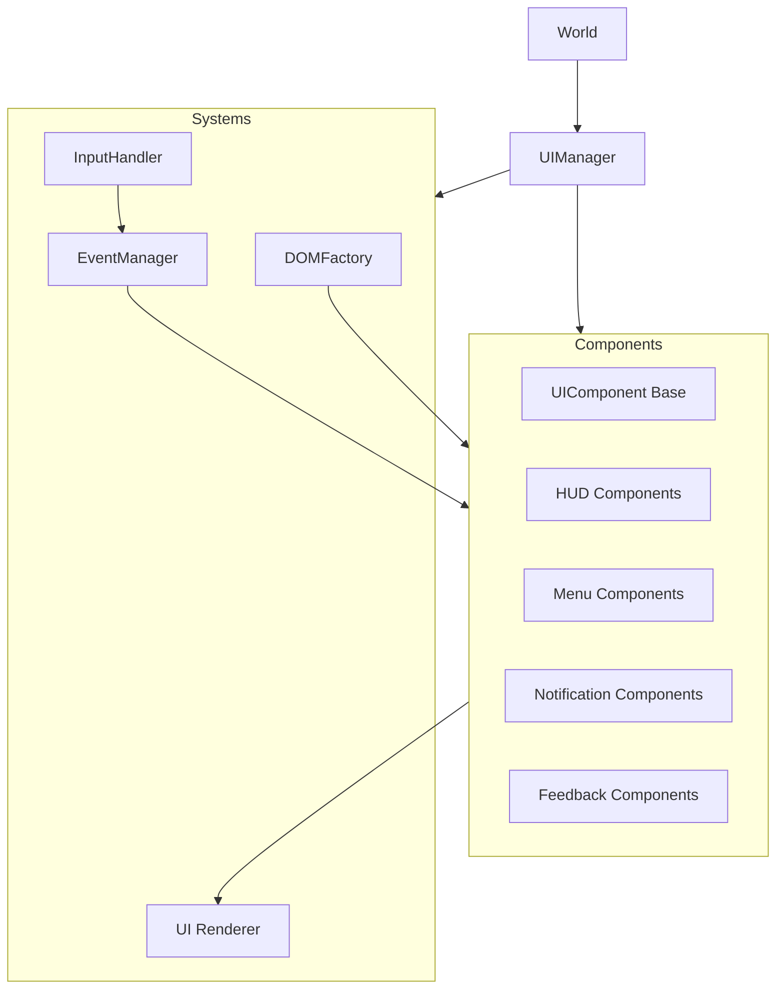

# System Patterns: RIFT FPS UI/CSS Redesign

## System Architecture

The redesigned RIFT FPS UI system employs a component-based architecture with clear separation of concerns and well-defined communication patterns. The architecture consists of these major elements:

### Core Components


### Component Hierarchy

```mermaid
flowchart TD
    UIComponent[UIComponent Base] --> HUD[HUD Components]
    UIComponent --> Menus[Menu Components]
    UIComponent --> Notifications[Notification Components]
    UIComponent --> Feedback[Feedback Components]
    
    HUD --> Health[HealthDisplay]
    HUD --> Ammo[AmmoDisplay]
    HUD --> Minimap[MinimapSystem]
    HUD --> Crosshair[CrosshairSystem]
    
    Menus --> WeaponWheel[WeaponWheel]
    Menus --> WorldMap[WorldMap]
    Menus --> RoundSummary[RoundSummary]
    Menus --> MissionBriefing[MissionBriefing]
    
    Notifications --> KillFeed[KillFeed]
    Notifications --> EventBanner[EventBanner]
    Notifications --> Achievements[AchievementSystem]
    Notifications --> Messages[NotificationManager]
    
    Feedback --> HitMarkers[HitIndicator]
    Feedback --> DamageEffects[DamageEffects]
    Feedback --> ScreenShake[ScreenShakeSystem]
    Feedback --> DamageNumbers[DamageNumbers]
```


## Key Design Patterns

### Component Pattern

All UI elements extend a common `UIComponent` base class that provides:
- Standard lifecycle methods (init, update, render, dispose)
- Event subscription management
- DOM element creation and management
- Consistent API for state changes

```javascript
class UIComponent {
    constructor(options = {}) {
        this.isInitialized = false;
        this.isVisible = false;
        this.options = options;
        this.elements = {};
        this._eventSubscriptions = [];
    }
    
    // Lifecycle methods
    init() { this.isInitialized = true; return this; }
    update(delta) { return this; }
    render() { return this; }
    dispose() { this._cleanupEvents(); return this; }
    
    // Event handling
    subscribe(eventType, handler) {
        const subscription = EventManager.subscribe(eventType, handler);
        this._eventSubscriptions.push(subscription);
        return subscription;
    }
    
    _cleanupEvents() {
        this._eventSubscriptions.forEach(sub => EventManager.unsubscribe(sub));
        this._eventSubscriptions = [];
    }
    
    // Visibility
    show() { this.isVisible = true; return this; }
    hide() { this.isVisible = false; return this; }
}
```

### Observer Pattern (Event System)

The event system facilitates communication between components without creating tight coupling:

```javascript
class EventManager {
    static _events = new Map();
    static _subscriptionId = 0;
    
    static subscribe(eventType, handler) {
        const id = this._subscriptionId++;
        
        if (!this._events.has(eventType)) {
            this._events.set(eventType, new Map());
        }
        
        this._events.get(eventType).set(id, handler);
        
        return { id, eventType };
    }
    
    static unsubscribe(subscription) {
        if (!subscription || !subscription.eventType) return false;
        
        const eventHandlers = this._events.get(subscription.eventType);
        if (eventHandlers) {
            return eventHandlers.delete(subscription.id);
        }
        return false;
    }
    
    static emit(eventType, data) {
        const eventHandlers = this._events.get(eventType);
        if (!eventHandlers) return;
        
        eventHandlers.forEach(handler => {
            try {
                handler(data);
            } catch (error) {
                console.error(`Error in event handler for ${eventType}:`, error);
            }
        });
    }
}
```

### Factory Pattern

The `DOMFactory` creates DOM elements with consistent styling and structure:

```javascript
class DOMFactory {
    static createElement(type, options = {}) {
        const element = document.createElement(type);
        
        if (options.className) {
            const classNames = Array.isArray(options.className) 
                ? options.className 
                : options.className.split(' ');
            element.classList.add(...classNames);
        }
        
        if (options.id) element.id = options.id;
        if (options.text) element.textContent = options.text;
        if (options.html) element.innerHTML = options.html;
        
        if (options.attributes) {
            Object.entries(options.attributes).forEach(([key, value]) => {
                element.setAttribute(key, value);
            });
        }
        
        if (options.styles) {
            Object.entries(options.styles).forEach(([prop, value]) => {
                element.style[prop] = value;
            });
        }
        
        if (options.parent) options.parent.appendChild(element);
        
        return element;
    }
    
    static createContainer(className, options = {}) {
        return this.createElement('div', {
            className: `rift-container ${className}`,
            ...options
        });
    }
}
```

### Adapter Pattern

To facilitate incremental migration, an adapter layer maintains compatibility with the original UIManager API:

```javascript
class UIManagerAdapter {
    constructor(newUIManager) {
        this.newUIManager = newUIManager;
        this._setupAdapters();
    }
    
    _setupAdapters() {
        // Map old API methods to new component methods
        this.updateHealthStatus = (percentage) => {
            this.newUIManager.getComponent('healthDisplay').updateHealth(percentage);
        };
        
        this.updateAmmoStatus = (roundsLeft, totalAmmo) => {
            this.newUIManager.getComponent('ammoDisplay').updateAmmo(roundsLeft, totalAmmo);
        };
        
        // ... other adapter methods
    }
}
```

## CSS Architecture

### BEM Methodology with Namespacing

All CSS classes follow BEM (Block, Element, Modifier) methodology with a `rift-` prefix:

```css
.rift-health { /* Block */ }
.rift-health__bar { /* Element */ }
.rift-health__bar--critical { /* Modifier */ }
```

### CSS Variables for Theming

CSS variables provide consistent theming across components:

```css
:root {
  /* Color Scheme */
  --primary-color: #e63946;
  --primary-glow: rgba(230, 57, 70, 0.7);
  --secondary-color: #33a8ff;
  --secondary-glow: rgba(51, 168, 255, 0.7);
  --success-color: #4caf50;
  --success-glow: rgba(76, 175, 80, 0.7);
  --warning-color: #ff9800;
  --warning-glow: rgba(255, 152, 0, 0.7);
  --danger-color: #f44336;
  --danger-glow: rgba(244, 67, 54, 0.7);
  
  /* UI Sizing */
  --hud-padding: 12px;
  --border-radius: 5px;
  
  /* Fonts */
  --font-hud: 'Rajdhani', 'Orbitron', sans-serif;
  --font-display: 'Orbitron', 'Rajdhani', sans-serif;
  --font-body: 'Exo 2', 'Rajdhani', sans-serif;
}
```

### Modular File Structure

CSS is organized into modular files following a clear directory structure:

```
/styles
│
├── /core
│   ├── _variables.css       # CSS variables, color schemes, fonts
│   ├── _reset.css           # Base reset styles  
│   ├── _typography.css      # Font definitions and text styles
│   ├── _animations.css      # All keyframe animations
│   └── _layout.css          # Basic layout styles and containers
│
├── /components
│   ├── /hud
│   │   ├── _health.css      # Health display styles
│   │   ├── _ammo.css        # Ammo counter styles
│   │   └── ... other HUD components
│   ├── /combat
│   │   ├── _damage.css      # Damage effects and numbers
│   │   └── ... other combat UI components
│   └── ... other component categories
│
└── main.css                 # Main file that imports all others
```

## Component Communication

### Event-Driven Communication

Components communicate through the central EventManager using namespaced event types:

```
health:changed       // Health value has changed
health:critical      // Health has reached critical level
health:restored      // Health has been restored to non-critical level

ammo:changed         // Ammo count has changed
ammo:depleted        // Out of ammo
ammo:reloading       // Reloading in progress
ammo:reloaded        // Reload complete

combat:hit           // Player hit an enemy
combat:hit:critical  // Player scored a critical hit
combat:damage:taken  // Player took damage
combat:kill          // Player killed an enemy

ui:notification      // Show a notification
ui:achievement       // Show an achievement
ui:screen:change     // Change the active screen
```

The event data structure is standardized for each event type:

```javascript
// Example event data
{
  type: 'health:changed',  // Event type (redundant but helpful)
  value: 75,               // New health value
  previous: 100,           // Previous health value
  timestamp: 1589302293,   // Time of event
  source: 'enemy_damage'   // Source of health change
}
```

## Rendering Strategy

### DOM-Based UI Elements

Most UI elements use DOM manipulation for:
- HUD elements (health, ammo, etc.)
- Menus and screens
- Notifications and messages
- Persistent UI components

### Canvas/WebGL Elements

Three.js rendering is used for:
- 3D elements that integrate with the game world
- Performance-critical particle effects
- Complex animations that would be inefficient with DOM
- Elements that need to sync precisely with the game world

## Performance Patterns

### DOM Optimization

To prevent layout thrashing and optimize performance:
- Batch DOM operations using DocumentFragments
- Use CSS transforms and opacity for animations
- Minimize reflows by reading layout properties all at once
- Use requestAnimationFrame for visual updates
- Implement visibility checks to avoid updating offscreen elements

### Event Optimization

To prevent memory leaks and improve performance:
- All event listeners are tracked and removed during component disposal
- Event handlers are debounced for frequently firing events
- Event data is kept minimal to reduce overhead
- Event types are categorized by priority

### Animation Strategy

For optimal animation performance:
- Use CSS animations for simple transitions (opacity, transform)
- Use requestAnimationFrame for complex JS-driven animations
- Prefer transform and opacity properties for animations
- Implement animation budgets for simultaneous effects
- Use will-change CSS property to optimize browser rendering

## Testing Approach

1. **Component Testing**: Each UI component is tested in isolation
2. **Interaction Testing**: Event communication between components is verified
3. **Visual Regression Testing**: UI appearance is compared against baseline
4. **Performance Testing**: UI is benchmarked for rendering performance
5. **Memory Testing**: Components are checked for memory leaks

## Implementation Path

The implementation follows a gradual migration path:

1. Create the core infrastructure (UIComponent, EventManager, DOMFactory)
2. Implement adapter layer that maps old UIManager to new components
3. Build core components one by one, replacing UIManager functionality
4. Refactor CSS following the new structure
5. Add enhanced features that weren't in the original implementation
6. Optimize performance and address edge cases
