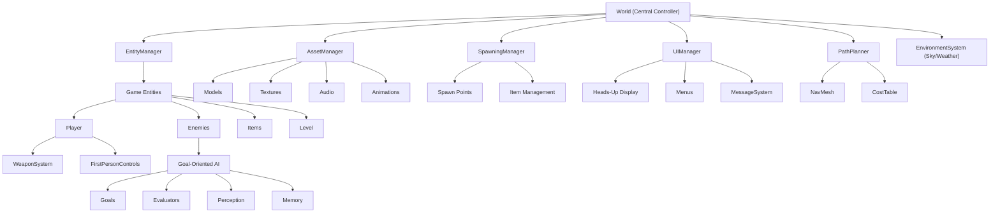
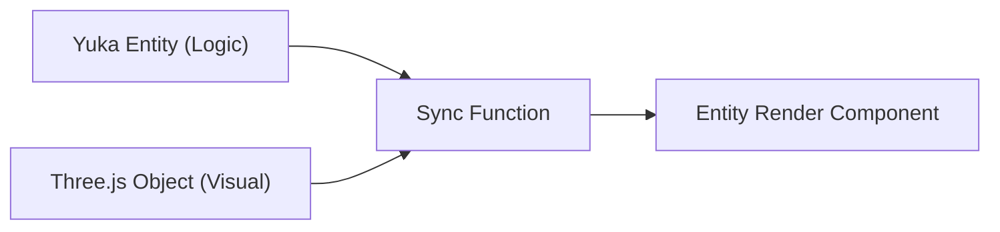
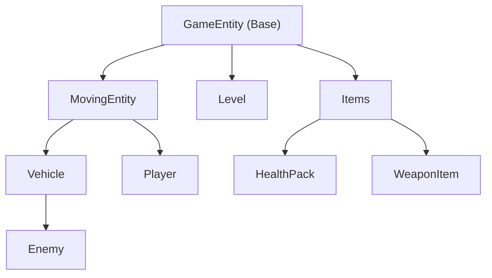
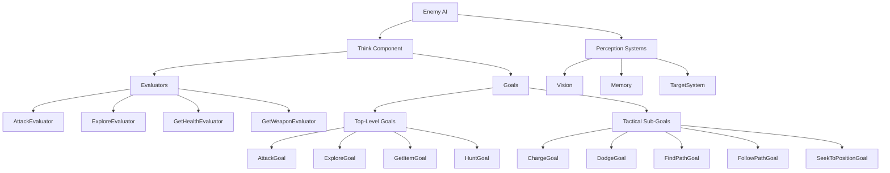
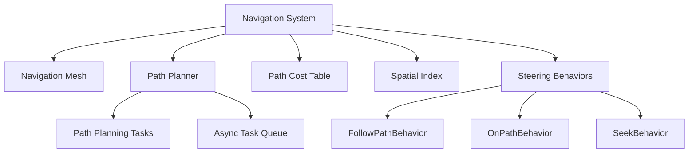
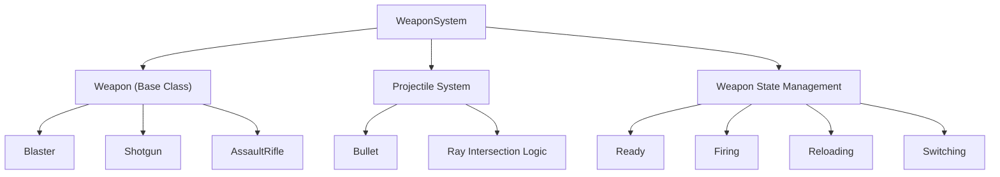
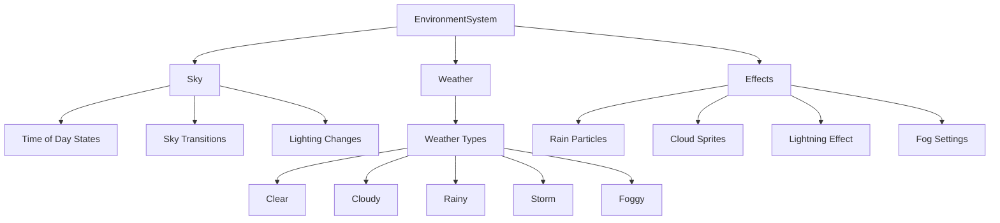
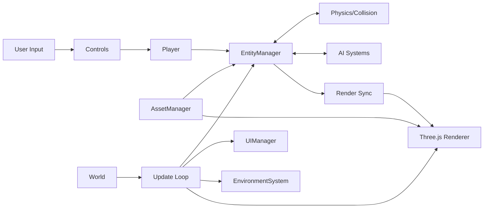

# RIFT: System Patterns

## High-Level Architecture

RIFT implements a hybrid component-entity architecture that integrates Three.js (for rendering) with Yuka.js (for game logic and AI). This architecture creates a clean separation between visual representation and game logic, allowing each system to focus on its specific responsibilities.



## Core System Components

### World Class

The `World` class serves as the central controller for the entire game, responsible for:
- Initializing and managing all subsystems
- Coordinating the game loop
- Managing scene setup and rendering
- Handling entity lifecycle
- Providing centralized access to shared resources

Pattern: **Facade Pattern** - Provides a simplified interface to the complex underlying systems.

### Entity-Component Relationship

A key architectural pattern in RIFT is the relationship between logical entities and their visual representations:



Key implementation:
```javascript
entity.setRenderComponent(threeJsObject, syncFunction);
```

Pattern: **Bridge Pattern** - Decouples abstraction (game entity) from implementation (visual representation).

### Game Entity Hierarchy



Pattern: **Composite Pattern** - Allows building complex entity hierarchies while treating individual objects and compositions uniformly.

## Key Subsystems

### AI Architecture

RIFT implements a sophisticated AI system using Goal-Oriented Action Planning (GOAP):



Pattern: **Strategy Pattern** - Enables selecting behavior algorithms (goals) at runtime based on context.

### Navigation System



Pattern: **Command Pattern** - Encapsulates path planning requests as objects (tasks) for asynchronous execution.

### Weapon System



Pattern: **Template Method Pattern** - Defines the skeleton of weapon behavior in the base class, with specifics implemented in subclasses.

### Environmental System



Pattern: **State Pattern** - Allows the environment to alter behavior when its internal state changes.

## Data Flow Architecture



Pattern: **Observer Pattern** - Components observe and react to changes in other parts of the system.

## Key Technical Decisions

### Rendering and Performance

1. **Asynchronous Processing**
   - Path planning tasks executed asynchronously to prevent frame drops
   - Asset loading with progress indicators for better UX
   - Frame-independent physics and movement calculations

2. **Spatial Optimization**
   - Cell-space partitioning for efficient entity management
   - Navigation mesh for optimized pathfinding
   - Level of detail (LOD) based on distance and visibility

3. **Memory Management**
   - Asset pooling for frequently used objects
   - Texture and model optimization
   - Efficient audio resource handling
   - Cleaning up unused resources

4. **Rendering Pipeline**
   - PBR (Physically Based Rendering) materials
   - Dynamic shadow mapping
   - Post-processing effects
   - SRGBColorSpace for accurate color reproduction
