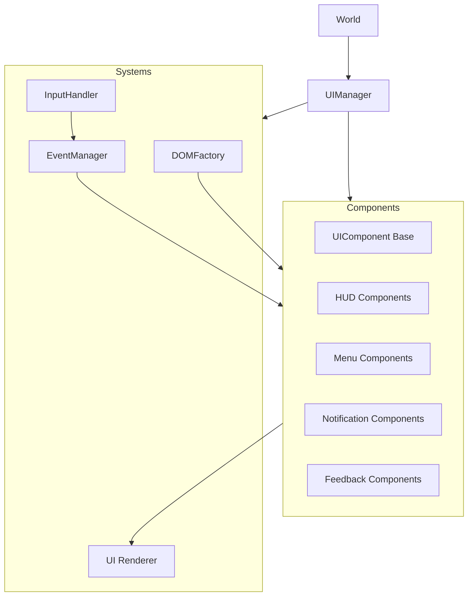

# System Patterns: RIFT FPS UI/CSS Redesign

## System Architecture

The RIFT FPS UI system employs a component-based architecture with clear separation of concerns and well-defined communication patterns. The architecture has now been implemented with these core elements:

### Core Components


### Component Hierarchy

```mermaid
flowchart TD
    UIComponent[UIComponent Base] --> HUD[HUD Components]
    UIComponent --> Menus[Menu Components]
    UIComponent --> Notifications[Notification Components]
    UIComponent --> Feedback[Feedback Components]
    UIComponent --> Environment[Environment Components]
    UIComponent --> Progression[Progression Components]
    
    HUD --> Health[HealthDisplay]
    HUD --> Ammo[AmmoDisplay]
    HUD --> Minimap[MinimapSystem]
    HUD --> Crosshair[CrosshairSystem]
    HUD --> Stamina[StaminaSystem]
    HUD --> Compass[CompassDisplay]
    HUD --> Weapon[WeaponWheel]
    
    Menus --> WorldMap[WorldMap]
    Menus --> RoundSummary[RoundSummary]
    Menus --> MissionBriefing[MissionBriefing]
    Menus --> ScreenManager[ScreenManager]
    Menus --> MenuSystem[MenuSystem]
    
    Notifications --> KillFeed[KillFeed]
    Notifications --> EventBanner[EventBanner]
    Notifications --> Achievements[AchievementDisplay]
    Notifications --> Messages[NotificationManager]
    Notifications --> NotificationSystem[NotificationSystem]
    
    Feedback --> Standard[Standard Feedback]
    Feedback --> Enhanced[Enhanced Feedback]
    
    Standard --> HitIndicator[HitIndicator]
    Standard --> DamageIndicator[DamageIndicator]
    Standard --> DamageNumbers[DamageNumbers]
    Standard --> ScreenEffects[ScreenEffects]
    Standard --> FootstepIndicator[FootstepIndicator]
    
    Enhanced --> EnhancedHitIndicator[EnhancedHitIndicator]
    Enhanced --> EnhancedDamageIndicator[EnhancedDamageIndicator]
    Enhanced --> DynamicCrosshairSystem[DynamicCrosshairSystem]
    Enhanced --> AdvancedScreenEffects[AdvancedScreenEffects]
    
    Environment --> Weather[WeatherSystem]
    Environment --> Objectives[ObjectiveMarkerSystem]
    Environment --> Danger[DangerZone]
    Environment --> Powerups[PowerupDisplay]
    Environment --> EnvironmentSystem[EnvironmentSystem]
    
    Progression --> XP[ExperienceBar]
    Progression --> Rank[PlayerRank]
    Progression --> Skills[SkillPointsDisplay]
    Progression --> ProgressionSystem[ProgressionSystem]
```


### Event Flow

```mermaid
flowchart TD
    WeaponSystem -- "weapon:fired" --> DynamicCrosshairSystem
    WeaponSystem -- "hit:registered" --> EnhancedHitIndicator
    WeaponSystem -- "hit:critical" --> EnhancedHitIndicator
    WeaponSystem -- "hit:headshot" --> EnhancedHitIndicator
    WeaponSystem -- "enemy:killed" --> EnhancedHitIndicator
    WeaponSystem -- "enemy:killed" --> KillFeed
    WeaponSystem -- "enemy:killed" --> XP[XPSystem]
    
    Enemy -- "player:damaged" --> EnhancedDamageIndicator
    Enemy -- "player:damaged" --> ScreenEffects
    Enemy -- "player:damaged" --> HealthDisplay
    
    HealthSystem -- "health:changed" --> HealthDisplay
    HealthSystem -- "health:critical" --> ScreenEffects
    HealthSystem -- "health:healed" --> ScreenEffects
    
    MovementSystem -- "footstep:detected" --> FootstepIndicator
    MovementSystem -- "player:sprint" --> StaminaSystem
    MovementSystem -- "player:movement" --> DynamicCrosshairSystem
    MovementSystem -- "player:stance" --> DynamicCrosshairSystem
    
    InputHandler -- "input:keydown" --> UIManager
    InputHandler -- "input:escape" --> MenuSystem
    InputHandler -- "input:mousemove" --> DynamicCrosshairSystem
    
    TargetingSystem -- "target:change" --> DynamicCrosshairSystem
```


## Implemented Design Patterns

### Component Pattern

The implemented `UIComponent` base class provides:
- Standard lifecycle methods (init, update, render, dispose)
- Event subscription management with automatic cleanup
- DOM element creation and management
- Consistent API for state changes
- Component hierarchies with parent-child relationships
- Animation system with easing functions
- State management with setState method
- Visibility controls (show/hide)

The actual implementation is robust and feature-rich:

```javascript
class UIComponent {
    constructor(options = {}) {
        this.id = options.id || `ui-component-${Math.floor(Math.random() * 10000)}`;
        this.className = options.className || '';
        this.template = options.template || '';
        this.container = options.container || null;
        this.isVisible = options.visible !== false;
        this.isInitialized = false;
        this.isActive = false;
        this.element = null;
        this.children = [];
        this.eventSubscriptions = [];
        this.animations = {};
        this.config = UIConfig;
        this.state = {};
        
        // ... bind methods, register events, auto-initialize
    }
    
    // Lifecycle methods
    init() { /* ... */ }
    update(delta) { /* ... */ }
    render() { /* ... */ }
    dispose() { /* ... */ }
    
    // Visibility
    show() { /* ... */ }
    hide() { /* ... */ }
    toggle() { /* ... */ }
    
    // State management
    setState(newState, render = true) { /* ... */ }
    
    // Child management
    addChild(child) { /* ... */ }
    removeChild(child) { /* ... */ }
    
    // Event handling
    registerEvents(events) { /* ... */ }
    unregisterEvent(eventName) { /* ... */ }
    unregisterAllEvents() { /* ... */ }
    
    // Animation
    addAnimation(name, options) { /* ... */ }
    startAnimation(name) { /* ... */ }
    stopAnimation(name, complete = false) { /* ... */ }
    
    // DOM creation
    createElement(type, options = {}) { /* ... */ }
    createBEMElement(blockName, elementName, options = {}) { /* ... */ }
    
    // Private methods
    _createRootElement() { /* ... */ }
    _updateAnimations(delta) { /* ... */ }
    _applyEasing(t, easingName) { /* ... */ }
}
```

### Observer Pattern (Event System)

The `EventManager` implementation provides a robust pub/sub system:

```javascript
class EventManager {
    constructor() {
        this._events = new Map();
        this._subscriptionId = 0;
        this._debugMode = false;
    }
    
    subscribe(eventType, handler) {
        const id = this._subscriptionId++;
        
        if (!this._events.has(eventType)) {
            this._events.set(eventType, new Map());
        }
        
        this._events.get(eventType).set(id, handler);
        
        if (this._debugMode) {
            console.log(`[EventManager] New subscription #${id} to '${eventType}'`);
        }
        
        return { id, eventType };
    }
    
    unsubscribe(subscription) { /* ... */ }
    
    emit(eventType, data = {}) {
        // ...
        // Create a standard event object
        const eventObject = {
            type: eventType,  // Event type (redundant but helpful)
            timestamp: performance.now(),  // Time of event
            ...data  // Spread the event data
        };
        
        eventHandlers.forEach((handler, id) => {
            try {
                handler(eventObject);
            } catch (error) {
                console.error(`[EventManager] Error in handler #${id} for '${eventType}':`, error);
            }
        });
    }
    
    // Additional utility methods
    hasSubscribers(eventType) { /* ... */ }
    subscriberCount(eventType) { /* ... */ }
    setDebugMode(enabled) { /* ... */ }
    clear() { /* ... */ }
    getEventTypes() { /* ... */ }
    getStats() { /* ... */ }
}
```

### Event Standardization (Phase 4)

As part of Phase 4 refinement, a comprehensive Event Standardization system has been designed with:

#### Event Naming Convention
```
[namespace]:[action]
```

Where:
- `namespace` identifies the source/domain (e.g., player, weapon, health)
- `action` describes what happened (e.g., damaged, killed, updated)

Example events:
- `health:changed` - Player health value changed
- `weapon:fired` - Weapon was fired
- `enemy:killed` - Enemy was eliminated

#### Standardized System Namespaces

The system defines a set of standardized namespaces for clarity and organization:

| Namespace | Description | Example Events |
|-----------|-------------|----------------|
| `player` | Player entity events | `player:spawn`, `player:death`, `player:movement` |
| `health` | Health-related events | `health:damaged`, `health:healed`, `health:critical` |
| `weapon` | Weapon system events | `weapon:fired`, `weapon:reload`, `weapon:switch` |
| `ammo` | Ammunition events | `ammo:low`, `ammo:depleted`, `ammo:added` |
| `enemy` | Enemy-related events | `enemy:spotted`, `enemy:damaged`, `enemy:killed` |
| `hit` | Hit detection events | `hit:registered`, `hit:critical`, `hit:headshot` |
| `combat` | Combat state events | `combat:started`, `combat:ended`, `combat:intensity` |
| `ui` | UI state changes | `ui:show`, `ui:hide`, `ui:resize` |

#### Standard Event Payload Structure

All events follow a standardized payload structure:

```javascript
{
  type: string,        // Event type (e.g., "health:changed")
  timestamp: number,   // Time of the event (performance.now())
  // Additional event-specific data...
}
```

Specialized payload structures exist for different event types:

1. **State Change Events**
```javascript
{
  type: "namespace:changed",
  timestamp: performance.now(),
  value: newValue,     // Current value
  previous: oldValue,  // Previous value
  delta: change,       // Amount changed (optional)
  max: maximum,        // Maximum possible value (optional)
  source: source       // What caused the change (optional)
}
```

2. **Combat Events**
```javascript
{
  type: "namespace:action",
  timestamp: performance.now(),
  source: {            // Source entity
    id: string,        // Entity ID
    type: string,      // Entity type (player, enemy, etc.)
    name: string,      // Entity name (optional)
    position: Vector3  // 3D position (optional)
  },
  target: {            // Target entity (similar to source)
    id: string,
    type: string,
    name: string,
    position: Vector3
  },
  weapon: {            // Weapon used (optional)
    id: string,
    type: string,
    name: string
  },
  damage: number,      // Damage amount (optional)
  isCritical: boolean, // Critical hit (optional)
  isHeadshot: boolean, // Headshot (optional)
  direction: Vector3   // Direction vector (optional)
}
```

### Factory Pattern

The `DOMFactory` implementation creates DOM elements with consistent styling and structure:

```javascript
class DOMFactory {
    static createElement(type, options = {}) {
        const element = document.createElement(type);
        
        if (options.className) {
            const classNames = Array.isArray(options.className) 
                ? options.className 
                : options.className.split(' ');
            element.classList.add(...classNames);
        }
        
        // ... set id, text, html, attributes, styles
        
        if (options.parent) {
            options.parent.appendChild(element);
        } else if (options.appendToBody) {
            document.body.appendChild(element);
        }
        
        return element;
    }
    
    // BEM specific methods
    static createContainer(blockName, options = {}) { /* ... */ }
    static createBEMElement(blockName, elementName, options = {}) { /* ... */ }
    
    // UI element specific helpers
    static createHUDElement(id, initialText = '', options = {}) { /* ... */ }
    static createButton(text, onClick, options = {}) { /* ... */ }
    static createIcon(iconName, options = {}) { /* ... */ }
    static createNotification(text, type = 'info', options = {}) { /* ... */ }
    static createProgressBar(value = 100, options = {}) { /* ... */ }
    static createModal(title, content, options = {}) { /* ... */ }
}
```

### Orchestrator Pattern

The new `UIManager` implements an orchestrator pattern rather than directly controlling UI elements:

```javascript
class UIManager {
    constructor(world) {
        this.world = world;
        this.config = UIConfig;
        this.isInitialized = false;
        this.isGamePaused = false;
        this.activeView = 'game'; // 'game', 'menu', 'pause'
        
        // Systems collection
        this.systems = {};
        
        // Performance tracking
        this.frameTime = 0;
        this.fpsCounter = { /* ... */ };
    }
    
    init() {
        // Initialize systems
        this._initSystems();
        
        // Setup FPS counter if enabled
        if (this.config.debug?.showFps) {
            this._setupFPSCounter();
        }
        
        // ... other initialization
    }
    
    update(delta) {
        // Skip updates if not initialized
        if (!this.isInitialized) return this;
        
        // Skip most updates if game is paused (except critical UI)
        if (this.isGamePaused && this.activeView !== 'pause') {
            this._updateFPSCounter(performance.now());
            return this;
        }
        
        // Update each system
        for (const key in this.systems) {
            // ... update logic for systems and subsystems
        }
        
        return this;
    }
    
    // UI control methods
    showFPSInterface() { /* ... */ }
    hideFPSInterface() { /* ... */ }
    setPaused(isPaused) { /* ... */ }
    addNotification(text, type = 'info') { /* ... */ }
    showMatchEvent(text, className = '') { /* ... */ }
    
    // System management methods
    _initSystems() { /* ... */ }
    setSize(width, height) { /* ... */ }
    dispose() { /* ... */ }
    
    // Performance monitoring
    _setupFPSCounter() { /* ... */ }
    _updateFPSCounter(timestamp) { /* ... */ }
    
    // Event handlers
    _onWindowResize() { /* ... */ }
}
```

### Enhanced Feedback System Pattern

The Enhanced Combat Feedback system implements a layered feedback approach with:

1. **Component Specialization**
   - Base components (HitIndicator, DamageIndicator) provide core functionality
   - Enhanced components extend base functionality with advanced features
   - UIConfig flags control which implementation to use

```javascript
// CombatSystem uses conditional initialization based on config
_initComponents() {
    // Check if enhanced hit indicator is enabled in UIConfig
    const useEnhancedHit = UIConfig.enhancedCombat && UIConfig.enhancedCombat.hitIndicator;
    
    if (useEnhancedHit) {
        // Initialize enhanced hit indicator
        this.enhancedHitIndicator = new EnhancedHitIndicator({
            container: this.element
        });
        this.enhancedHitIndicator.init();
        this.addChild(this.enhancedHitIndicator);
    } else {
        // Initialize legacy hit indicator
        this.hitIndicator = new HitIndicator({
            container: this.element,
            hitDuration: this.config.hitDuration || 500
        });
        this.hitIndicator.init();
        this.addChild(this.hitIndicator);
    }
    
    // Similar pattern for other components...
}
```

2. **Layered Architecture** 
   - Components like DynamicCrosshairSystem use a layered approach for separation of concerns:

```javascript
_createCrosshairLayers() {
    // Create layers in order from bottom to top
    const layerTypes = ['base', 'spread', 'center', 'hitmarker', 'context'];
    
    layerTypes.forEach(type => {
        this.layers[type] = DOMFactory.createElement('div', {
            className: `rift-dynamic-crosshair__layer rift-dynamic-crosshair__layer--${type}`,
            parent: this.element
        });
        
        // Create specific elements for each layer
        if (type === 'spread') {
            // Create spread indicators
            ['top', 'right', 'bottom', 'left'].forEach(direction => {
                DOMFactory.createElement('div', {
                    className: `rift-dynamic-crosshair__spread rift-dynamic-crosshair__spread--${direction}`,
                    parent: this.layers[type]
                });
            });
        } else if (type === 'center') {
            // Create center dot
            DOMFactory.createElement('div', {
                className: 'rift-dynamic-crosshair__center',
                parent: this.layers[type]
            });
        }
        // ... other layer-specific elements
    });
}
```

3. **State-Based Styling**
   - CSS variables and class toggling for dynamic visual changes:

```javascript
_setCrosshairState(state, target = null) {
    // Remove all state classes
    this.element.classList.remove(
        'rift-dynamic-crosshair--default',
        'rift-dynamic-crosshair--enemy',
        'rift-dynamic-crosshair--friendly',
        'rift-dynamic-crosshair--interactive'
    );
    
    // Add current state class
    this.element.classList.add(`rift-dynamic-crosshair--${state}`);
    this.currentState = state;
    
    // Update context hint if applicable
    if (state === 'interactive' && target && target.action) {
        this._showContextHint(target.action);
    } else {
        this._hideContextHint();
    }
    
    // Update crosshair color based on state
    const stateColor = this.config.states?.[state] || this.config.states?.default || 'rgba(255, 255, 255, 0.8)';
    this.element.style.setProperty('--crosshair-color', stateColor);
}
```

4. **Enhanced CSS Pattern**
   - CSS variables for dynamic property changes
   - Compound selectors for state-specific styling
   - Hardware-accelerated properties for performance

```css
.rift-dynamic-crosshair {
    --crosshair-color: var(--rift-crosshair-default);
    --crosshair-size: var(--rift-crosshair-size);
    --crosshair-thickness: var(--rift-crosshair-thickness);
    --crosshair-spread: 0px;
    --crosshair-opacity: 1;
    
    position: absolute;
    top: 50%;
    left: 50%;
    transform: translate(-50%, -50%);
    width: var(--crosshair-size);
    height: var(--crosshair-size);
    transition: --crosshair-spread 0.1s var(--rift-easing-out);
    pointer-events: none;
}

.rift-dynamic-crosshair--enemy {
    --crosshair-color: var(--rift-crosshair-enemy);
}

.rift-dynamic-crosshair--critical-potential .rift-dynamic-crosshair__center {
    box-shadow: var(--crosshair-critical-glow);
}

.rift-dynamic-crosshair__spread {
    position: absolute;
    background-color: var(--crosshair-color);
    width: var(--crosshair-thickness);
    height: var(--crosshair-thickness);
    opacity: var(--crosshair-opacity);
    transition: transform 0.1s var(--rift-easing-out);
}

.rift-dynamic-crosshair__spread--top {
    top: 0;
    left: 50%;
    transform: translate(-50%, calc(-1 * var(--crosshair-spread)));
}
```

## CSS Architecture

### BEM Methodology with Namespacing

The CSS variables file demonstrates the BEM methodology with "rift-" prefix:

```css
:root {
  /* Primary Colors */
  --rift-primary: #e63946;
  --rift-primary-glow: rgba(230, 57, 70, 0.7);
  --rift-primary-light: #ff4d5e;
  --rift-primary-dark: #c62f3b;
  
  /* Typography */
  --rift-font-hud: 'Rajdhani', 'Orbitron', sans-serif;
  --rift-font-display: 'Orbitron', 'Rajdhani', sans-serif; 
  --rift-font-body: 'Exo 2', 'Rajdhani', sans-serif;
  
  /* ... other CSS variables */
}
```

### CSS Variables for Theming

CSS variables provide consistent theming across components, mirrored in UIConfig:

```javascript
export const UIConfig = {
    // CSS Variables (should match :root in CSS)
    colors: {
        primary: '#e63946',
        primaryGlow: 'rgba(230, 57, 70, 0.7)',
        secondary: '#33a8ff',
        // ... other colors
    },
    
    // Font settings
    fonts: {
        hud: "'Rajdhani', 'Orbitron', sans-serif",
        display: "'Orbitron', 'Rajdhani', sans-serif",
        body: "'Exo 2', 'Rajdhani', sans-serif"
    },
    
    // ... other configuration values
}
```

## Component Communication

### Event-Driven Communication

Components communicate through the central EventManager using namespaced event types. The UIComponent includes automatic subscription tracking and cleanup:

```javascript
// In UIComponent
registerEvents(events) {
    if (!EventManager) return this;
    
    // Loop through event definitions
    for (const [eventName, handler] of Object.entries(events)) {
        // Create bound handler
        const boundHandler = typeof handler === 'function' 
            ? handler.bind(this) 
            : (typeof this[handler] === 'function' ? this[handler].bind(this) : null);
            
        if (boundHandler) {
            // Subscribe to event
            EventManager.on(eventName, boundHandler);
            
            // Save subscription for cleanup
            this.eventSubscriptions.push({
                name: eventName,
                handler: boundHandler
            });
        }
    }
    
    return this;
}

// Automatic cleanup in dispose()
dispose() {
    // Dispose children first
    this.children.forEach(child => {
        if (typeof child.dispose === 'function') {
            child.dispose();
        }
    });
    
    // Unsubscribe from all events
    this.unregisterAllEvents();
    
    // Remove from DOM
    if (this.element && this.element.parentNode) {
        this.element.parentNode.removeChild(this.element);
    }
    
    // ... other cleanup
}
```

The event data structure is standardized in EventManager:

```javascript
// In EventManager.emit()
const eventObject = {
    type: eventType,       // Event type 
    timestamp: performance.now(),  // Time of event
    ...data                // Spread the event data
};
```

## Performance Patterns

### DOM Optimization

The DOMFactory and UIComponent implementations show DOM optimization:

1. **Element Creation**: DOMFactory provides optimized element creation
2. **Event Delegation**: InputHandler uses event delegation for efficiency
3. **Component Lifecycle**: UIComponent ensures proper initialization and cleanup
4. **Animation Performance**: UIComponent includes an animation system with easing

### Animation Strategy

The UIComponent class implements an animation system:

```javascript
addAnimation(name, options) {
    if (!name || !options.update || !options.duration) return this;
    
    this.animations[name] = {
        name,
        startTime: options.autoStart !== false ? performance.now() : null,
        duration: options.duration * 1000, // Convert to ms
        update: options.update,
        complete: options.complete || null,
        easing: options.easing || 'linear',
        progress: 0,
        isComplete: false,
        isActive: options.autoStart !== false
    };
    
    return this;
}

// Update animations in the component update cycle
_updateAnimations(delta) {
    const now = performance.now();
    
    for (const key in this.animations) {
        const anim = this.animations[key];
        
        if (!anim.isActive || anim.isComplete) continue;
        
        if (anim.startTime === null) {
            anim.startTime = now;
            continue;
        }
        
        // Calculate progress (0-1)
        const elapsed = now - anim.startTime;
        const rawProgress = Math.min(1, elapsed / anim.duration);
        
        // Apply easing
        anim.progress = this._applyEasing(rawProgress, anim.easing);
        
        // Call update function
        anim.update(anim.progress);
        
        // Check if complete
        if (rawProgress >= 1) {
            anim.isComplete = true;
            
            // Call complete callback if provided
            if (anim.complete && typeof anim.complete === 'function') {
                anim.complete();
            }
        }
    }
}
