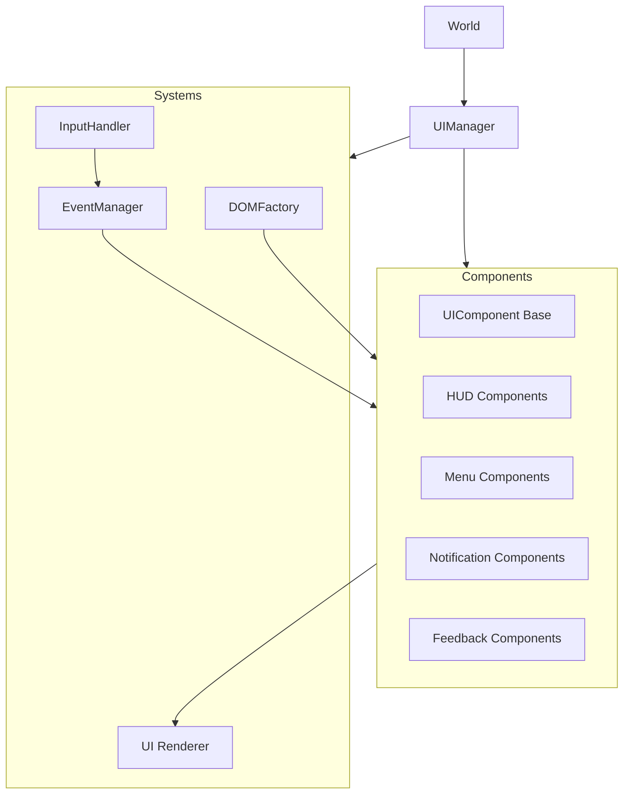

# System Patterns: RIFT FPS UI/CSS Redesign

## System Architecture

The RIFT FPS UI system employs a component-based architecture with clear separation of concerns and well-defined communication patterns. The architecture has now been implemented with these core elements:

### Core Components


### Component Hierarchy

```mermaid
flowchart TD
    UIComponent[UIComponent Base] --> HUD[HUD Components]
    UIComponent --> Menus[Menu Components]
    UIComponent --> Notifications[Notification Components]
    UIComponent --> Feedback[Feedback Components]
    
    HUD --> Health[HealthDisplay]
    HUD --> Ammo[AmmoDisplay]
    HUD --> Minimap[MinimapSystem]
    HUD --> Crosshair[CrosshairSystem]
    
    Menus --> WeaponWheel[WeaponWheel]
    Menus --> WorldMap[WorldMap]
    Menus --> RoundSummary[RoundSummary]
    Menus --> MissionBriefing[MissionBriefing]
    
    Notifications --> KillFeed[KillFeed]
    Notifications --> EventBanner[EventBanner]
    Notifications --> Achievements[AchievementSystem]
    Notifications --> Messages[NotificationManager]
    
    Feedback --> HitMarkers[HitIndicator]
    Feedback --> DamageEffects[DamageEffects]
    Feedback --> ScreenShake[ScreenShakeSystem]
    Feedback --> DamageNumbers[DamageNumbers]
```


## Implemented Design Patterns

### Component Pattern

The implemented `UIComponent` base class provides:
- Standard lifecycle methods (init, update, render, dispose)
- Event subscription management with automatic cleanup
- DOM element creation and management
- Consistent API for state changes
- Component hierarchies with parent-child relationships
- Animation system with easing functions
- State management with setState method
- Visibility controls (show/hide)

The actual implementation is robust and feature-rich:

```javascript
class UIComponent {
    constructor(options = {}) {
        this.id = options.id || `ui-component-${Math.floor(Math.random() * 10000)}`;
        this.className = options.className || '';
        this.template = options.template || '';
        this.container = options.container || null;
        this.isVisible = options.visible !== false;
        this.isInitialized = false;
        this.isActive = false;
        this.element = null;
        this.children = [];
        this.eventSubscriptions = [];
        this.animations = {};
        this.config = UIConfig;
        this.state = {};
        
        // ... bind methods, register events, auto-initialize
    }
    
    // Lifecycle methods
    init() { /* ... */ }
    update(delta) { /* ... */ }
    render() { /* ... */ }
    dispose() { /* ... */ }
    
    // Visibility
    show() { /* ... */ }
    hide() { /* ... */ }
    toggle() { /* ... */ }
    
    // State management
    setState(newState, render = true) { /* ... */ }
    
    // Child management
    addChild(child) { /* ... */ }
    removeChild(child) { /* ... */ }
    
    // Event handling
    registerEvents(events) { /* ... */ }
    unregisterEvent(eventName) { /* ... */ }
    unregisterAllEvents() { /* ... */ }
    
    // Animation
    addAnimation(name, options) { /* ... */ }
    startAnimation(name) { /* ... */ }
    stopAnimation(name, complete = false) { /* ... */ }
    
    // DOM creation
    createElement(type, options = {}) { /* ... */ }
    createBEMElement(blockName, elementName, options = {}) { /* ... */ }
    
    // Private methods
    _createRootElement() { /* ... */ }
    _updateAnimations(delta) { /* ... */ }
    _applyEasing(t, easingName) { /* ... */ }
}
```

### Observer Pattern (Event System)

The `EventManager` implementation provides a robust pub/sub system:

```javascript
class EventManager {
    constructor() {
        this._events = new Map();
        this._subscriptionId = 0;
        this._debugMode = false;
    }
    
    subscribe(eventType, handler) {
        const id = this._subscriptionId++;
        
        if (!this._events.has(eventType)) {
            this._events.set(eventType, new Map());
        }
        
        this._events.get(eventType).set(id, handler);
        
        if (this._debugMode) {
            console.log(`[EventManager] New subscription #${id} to '${eventType}'`);
        }
        
        return { id, eventType };
    }
    
    unsubscribe(subscription) { /* ... */ }
    
    emit(eventType, data = {}) {
        // ...
        // Create a standard event object
        const eventObject = {
            type: eventType,  // Event type (redundant but helpful)
            timestamp: performance.now(),  // Time of event
            ...data  // Spread the event data
        };
        
        eventHandlers.forEach((handler, id) => {
            try {
                handler(eventObject);
            } catch (error) {
                console.error(`[EventManager] Error in handler #${id} for '${eventType}':`, error);
            }
        });
    }
    
    // Additional utility methods
    hasSubscribers(eventType) { /* ... */ }
    subscriberCount(eventType) { /* ... */ }
    setDebugMode(enabled) { /* ... */ }
    clear() { /* ... */ }
    getEventTypes() { /* ... */ }
    getStats() { /* ... */ }
}
```

### Factory Pattern

The `DOMFactory` implementation creates DOM elements with consistent styling and structure:

```javascript
class DOMFactory {
    static createElement(type, options = {}) {
        const element = document.createElement(type);
        
        if (options.className) {
            const classNames = Array.isArray(options.className) 
                ? options.className 
                : options.className.split(' ');
            element.classList.add(...classNames);
        }
        
        // ... set id, text, html, attributes, styles
        
        if (options.parent) {
            options.parent.appendChild(element);
        } else if (options.appendToBody) {
            document.body.appendChild(element);
        }
        
        return element;
    }
    
    // BEM specific methods
    static createContainer(blockName, options = {}) { /* ... */ }
    static createBEMElement(blockName, elementName, options = {}) { /* ... */ }
    
    // UI element specific helpers
    static createHUDElement(id, initialText = '', options = {}) { /* ... */ }
    static createButton(text, onClick, options = {}) { /* ... */ }
    static createIcon(iconName, options = {}) { /* ... */ }
    static createNotification(text, type = 'info', options = {}) { /* ... */ }
    static createProgressBar(value = 100, options = {}) { /* ... */ }
    static createModal(title, content, options = {}) { /* ... */ }
}
```

### Orchestrator Pattern

The new `UIManager` implements an orchestrator pattern rather than directly controlling UI elements:

```javascript
class UIManager {
    constructor(world) {
        this.world = world;
        this.config = UIConfig;
        this.isInitialized = false;
        this.isGamePaused = false;
        this.activeView = 'game'; // 'game', 'menu', 'pause'
        
        // Systems collection
        this.systems = {};
        
        // Performance tracking
        this.frameTime = 0;
        this.fpsCounter = { /* ... */ };
    }
    
    init() {
        // Initialize systems
        this._initSystems();
        
        // Setup FPS counter if enabled
        if (this.config.debug?.showFps) {
            this._setupFPSCounter();
        }
        
        // ... other initialization
    }
    
    update(delta) {
        // Skip updates if not initialized
        if (!this.isInitialized) return this;
        
        // Skip most updates if game is paused (except critical UI)
        if (this.isGamePaused && this.activeView !== 'pause') {
            this._updateFPSCounter(performance.now());
            return this;
        }
        
        // Update each system
        for (const key in this.systems) {
            // ... update logic for systems and subsystems
        }
        
        return this;
    }
    
    // UI control methods
    showFPSInterface() { /* ... */ }
    hideFPSInterface() { /* ... */ }
    setPaused(isPaused) { /* ... */ }
    addNotification(text, type = 'info') { /* ... */ }
    showMatchEvent(text, className = '') { /* ... */ }
    
    // System management methods
    _initSystems() { /* ... */ }
    setSize(width, height) { /* ... */ }
    dispose() { /* ... */ }
    
    // Performance monitoring
    _setupFPSCounter() { /* ... */ }
    _updateFPSCounter(timestamp) { /* ... */ }
    
    // Event handlers
    _onWindowResize() { /* ... */ }
}
```

### Input Handler Pattern

The `InputHandler` centralizes input processing for UI interactions:

```javascript
class InputHandler {
    constructor(uiManager) {
        this.uiManager = uiManager;
        this.isEnabled = false;
        
        // Track state
        this.pointerPosition = { x: 0, y: 0 };
        this.pointerNormalized = { x: 0, y: 0 }; // -1 to 1
        this.isPointerDown = false;
        this.activePointerButton = -1;
        this.keysDown = new Set();
        this.gestureStartDistance = 0;
        this.gestureScale = 1;
        this.hoveredElements = [];
        
        // ... bind methods
    }
    
    // Lifecycle
    enable() { /* ... */ }
    disable() { /* ... */ }
    dispose() { /* ... */ }
    
    // Event handlers
    _onMouseMove(event) { /* ... */ }
    _onMouseDown(event) { /* ... */ }
    _onMouseUp(event) { /* ... */ }
    _onContextMenu(event) { /* ... */ }
    _onKeyDown(event) { /* ... */ }
    _onKeyUp(event) { /* ... */ }
    _onBlur() { /* ... */ }
    _onTouchStart(event) { /* ... */ }
    _onTouchMove(event) { /* ... */ }
    _onTouchEnd(event) { /* ... */ }
    
    // Utility methods
    isKeyDown(key) { /* ... */ }
    isAnyKeyDown(keys) { /* ... */ }
    getCursorPosition() { /* ... */ }
    getNormalizedCursorPosition() { /* ... */ }
}
```

## CSS Architecture

### BEM Methodology with Namespacing

The CSS variables file demonstrates the BEM methodology with "rift-" prefix:

```css
:root {
  /* Primary Colors */
  --rift-primary: #e63946;
  --rift-primary-glow: rgba(230, 57, 70, 0.7);
  --rift-primary-light: #ff4d5e;
  --rift-primary-dark: #c62f3b;
  
  /* Typography */
  --rift-font-hud: 'Rajdhani', 'Orbitron', sans-serif;
  --rift-font-display: 'Orbitron', 'Rajdhani', sans-serif; 
  --rift-font-body: 'Exo 2', 'Rajdhani', sans-serif;
  
  /* ... other CSS variables */
}
```

### CSS Variables for Theming

CSS variables provide consistent theming across components, mirrored in UIConfig:

```javascript
export const UIConfig = {
    // CSS Variables (should match :root in CSS)
    colors: {
        primary: '#e63946',
        primaryGlow: 'rgba(230, 57, 70, 0.7)',
        secondary: '#33a8ff',
        // ... other colors
    },
    
    // Font settings
    fonts: {
        hud: "'Rajdhani', 'Orbitron', sans-serif",
        display: "'Orbitron', 'Rajdhani', sans-serif",
        body: "'Exo 2', 'Rajdhani', sans-serif"
    },
    
    // ... other configuration values
}
```

## Component Communication

### Event-Driven Communication

Components communicate through the central EventManager using namespaced event types. The UIComponent includes automatic subscription tracking and cleanup:

```javascript
// In UIComponent
registerEvents(events) {
    if (!EventManager) return this;
    
    // Loop through event definitions
    for (const [eventName, handler] of Object.entries(events)) {
        // Create bound handler
        const boundHandler = typeof handler === 'function' 
            ? handler.bind(this) 
            : (typeof this[handler] === 'function' ? this[handler].bind(this) : null);
            
        if (boundHandler) {
            // Subscribe to event
            EventManager.on(eventName, boundHandler);
            
            // Save subscription for cleanup
            this.eventSubscriptions.push({
                name: eventName,
                handler: boundHandler
            });
        }
    }
    
    return this;
}

// Automatic cleanup in dispose()
dispose() {
    // Dispose children first
    this.children.forEach(child => {
        if (typeof child.dispose === 'function') {
            child.dispose();
        }
    });
    
    // Unsubscribe from all events
    this.unregisterAllEvents();
    
    // Remove from DOM
    if (this.element && this.element.parentNode) {
        this.element.parentNode.removeChild(this.element);
    }
    
    // ... other cleanup
}
```

The event data structure is standardized in EventManager:

```javascript
// In EventManager.emit()
const eventObject = {
    type: eventType,       // Event type 
    timestamp: performance.now(),  // Time of event
    ...data                // Spread the event data
};
```

## Performance Patterns

### DOM Optimization

The DOMFactory and UIComponent implementations show DOM optimization:

1. **Element Creation**: DOMFactory provides optimized element creation
2. **Event Delegation**: InputHandler uses event delegation for efficiency
3. **Component Lifecycle**: UIComponent ensures proper initialization and cleanup
4. **Animation Performance**: UIComponent includes an animation system with easing

### Animation Strategy

The UIComponent class implements an animation system:

```javascript
addAnimation(name, options) {
    if (!name || !options.update || !options.duration) return this;
    
    this.animations[name] = {
        name,
        startTime: options.autoStart !== false ? performance.now() : null,
        duration: options.duration * 1000, // Convert to ms
        update: options.update,
        complete: options.complete || null,
        easing: options.easing || 'linear',
        progress: 0,
        isComplete: false,
        isActive: options.autoStart !== false
    };
    
    return this;
}

// Update animations in the component update cycle
_updateAnimations(delta) {
    const now = performance.now();
    
    for (const key in this.animations) {
        const anim = this.animations[key];
        
        if (!anim.isActive || anim.isComplete) continue;
        
        // ... animation update logic with easing
    }
}
```

## Implementation Path

The current implementation has followed a clear path:

1. ✅ Create the core infrastructure (UIComponent, EventManager, DOMFactory, InputHandler)
2. ✅ Implement new UIManager as orchestrator
3. ✅ Establish CSS foundation with variables
4. ✅ Create component-specific CSS files (health display, hud layout)
5. ✅ Build core HUD components:
   - ✅ Created `HUDSystem` as a coordinator for all HUD elements
   - ✅ Implemented `HealthDisplay` component with various health states and animations
   - ✅ Added HUD layout system with positioning containers
   - ✅ Integrated HUDSystem into UIManager
6. ✅ Implement additional HUD components:
   - ✅ Created `AmmoDisplay` component with magazine visualization
   - ✅ Implemented ammunition state handling (low ammo, reloading)
   - ✅ Added bullet visualizer with weapon-specific styling
7. ✅ Implement crosshair component:
   - ✅ Created `CrosshairSystem` component with dynamic spread mechanics
   - ✅ Implemented hit markers with critical/headshot variations
   - ✅ Added contextual states for enemy targeting
   - ✅ Integrated weapon-specific crosshair styles
8. ✅ Implement minimap component:
   - ✅ Created `MinimapSystem` component integrating existing functionality
   - ✅ Implemented BEM-based CSS with responsive design
   - ✅ Added interactive features (zoom, rotate, expand)
   - ✅ Integrated with event system for notifications
   - ✅ Created specialized icons for players, enemies, items, and objectives
9. ✅ Implement stamina and compass components:
   - ✅ Created `StaminaSystem` component for sprint mechanics
   - ✅ Implemented visual feedback for various stamina states
   - ✅ Added `CompassDisplay` component with orientation and waypoint support
   - ✅ Integrated both systems with existing HUD layout
10. ✅ Begin implementing combat feedback systems:
   - ✅ Created `CombatSystem` as a coordinator for combat feedback components
   - ✅ Implemented `HitIndicator` component for hit confirmation feedback
   - ✅ Added support for regular, critical, and headshot hit markers
   - ✅ Implemented directional damage indicators for situational awareness
   - ✅ Created kill confirmation animations for feedback
   - ✅ Established CSS structure for combat-related components
11. 🔄 Next: Continue implementing feedback systems (DamageIndicator, DamageNumbers)
12. ⏳ Coming: Notification system and advanced features
13. ⏳ Coming: Performance optimization and accessibility features
